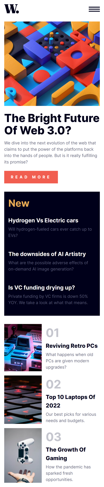
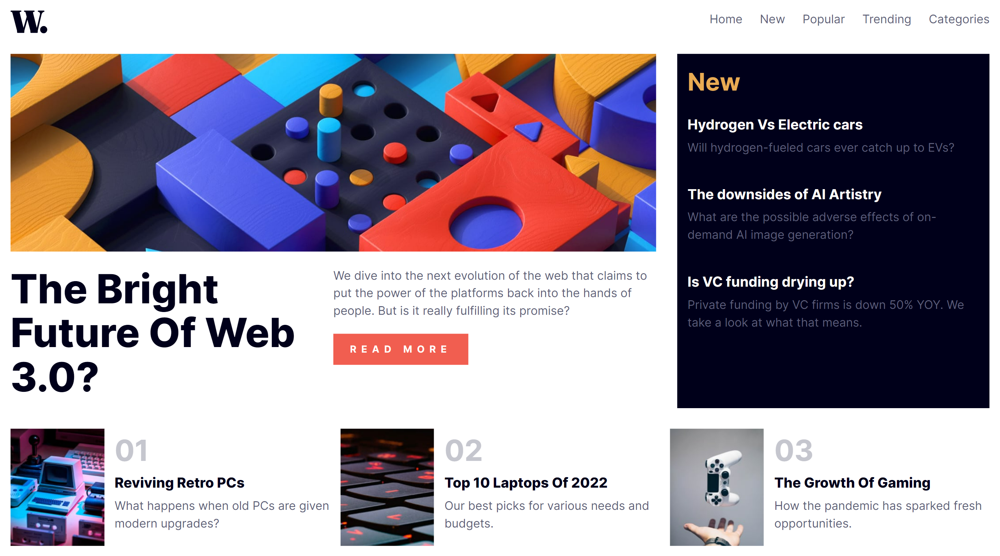

# Frontend Mentor - News homepage solution

This is a solution to the [News homepage challenge on Frontend Mentor](https://www.frontendmentor.io/challenges/news-homepage-H6SWTa1MFl). Frontend Mentor challenges help you improve your coding skills by building realistic projects. 

## Table of contents

- [Overview](#overview)
  - [The challenge](#the-challenge)
  - [Screenshot](#screenshot)
  - [Links](#links)
- [My process](#my-process)
  - [Built with](#built-with)
  - [What I learned](#what-i-learned)
  - [Continued development](#continued-development)
  - [Useful resources](#useful-resources)

**Note: Delete this note and update the table of contents based on what sections you keep.**

## Overview

### The challenge

Users should be able to:

- View the optimal layout for the interface depending on their device's screen size
- See hover and focus states for all interactive elements on the page
- **Bonus**: Toggle the mobile menu (requires some JavaScript)

### Screenshot




### Links

- Solution URL: [news homepage live site](https://disney-banje.github.io/news-homepage-main/)

## My process

### Built with

- Semantic HTML5 markup
- CSS custom properties
- Flexbox
- CSS Grid
- Mobile-first workflow

### What I learned

While doing this project, I challenged myself to generate the toggle menu in JavaScript using the functional programming paradigm, mainly because lately I have been learning React, and learning to manipulate the DOM (Document Object Model), and this project was best suited to assess my acquired knowledge.

To see how I use a function to create an HTML wrapper for elements using the DOM, see below:

```js
 function createDropdownMenu() {
        const container = document.createElement('div');
        container.classList.add('dropdown');

        // create container elements...
        const closeMenu = document.createElement('img');
        closeMenu.src = 'assets/images/icon-menu-close.svg';
        closeMenu.alt = 'close menu icon';
        closeMenu.classList.add('dropdown-close');

        // Closing the container
        closeMenu.addEventListener('click', () => {
            console.log('close menu clicked');
            container.style.display = 'none';
            cover.classList.add('display');
        })

        container.appendChild(closeMenu);

        const linkGroup = document.createElement('ul');
        linkGroup.classList.add('link-group');
        linkCollection.forEach(item => {
            const linkElement = document.createElement('li');
            const link = document.createElement('a');
            link.href = '#';
            link.textContent = item;
            linkElement.appendChild(link);
            linkGroup.appendChild(linkElement);
        });
        container.appendChild(linkGroup);


        return container;
    }
```

### Continued development

For the future, I think I will be deepening my understanding on some key concepts in JavaScript, since my goal is to start to learn React and start using it in my future projects. Additionally, I think the overall javascript code is an improvement looking back at my previous implementation.

### Useful resources

- [Understanding the DOM - Document Object Model](https://www.digitalocean.com/community/tutorial-series/understanding-the-dom-document-object-model) - I keep adding this resource to my projects, because it helped me have a first feel of the DOM and also an introduction, using simpler vocabular, what every element in the DOM is doing under the hood.

